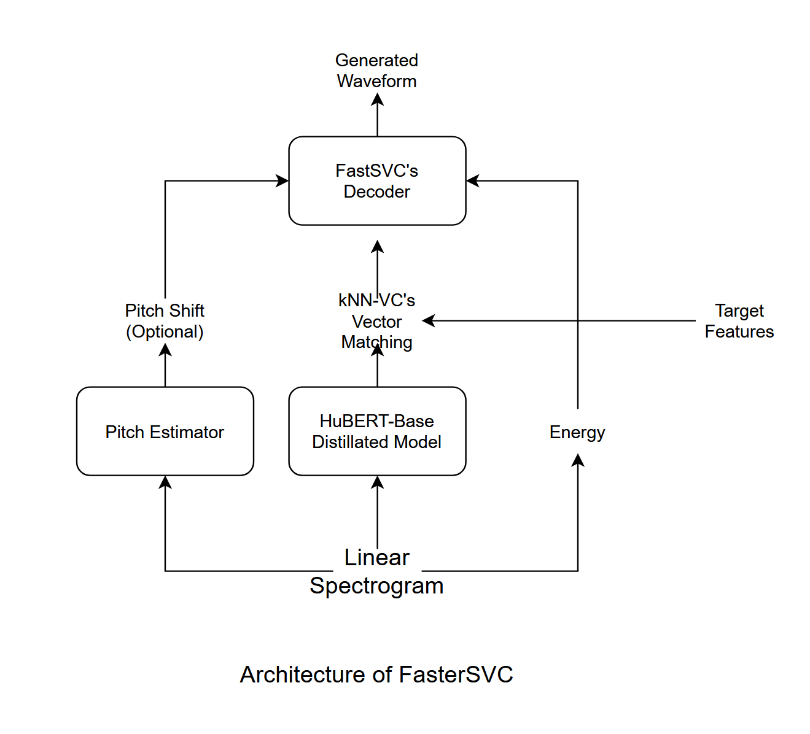

# FasterSVC : 低遅延なリアルタイム推論のためのFastSVCの改造

## モデル構造

デコーダーの構造はFastSVCとよく似ているが、FiLM層を一つ減らしたり、"Causal"な畳み込み層に変更したりしている。

## 特徴
- ストリーミング変換 (Intel Core i7-10700 にて検証)
- 低遅延 (a.c. 0.2 seconds)
- 高品質 (ソースフィルタモデルに基づくため)
- k近傍法に基づく話者スタイル変換
- 軽量

## Requirements
- Python
- PyTorch と GPU 環境

## インストール
1. このリポジトリをクローン
```sh
git clone https://github.com/uthree/fastersvc.git
```
2. 依存関係をインストール
```sh
pip3 install -r requirements.txt
```

## 学習
1. ピッチ推定器を学習
```sh
python3 train_pe.py <dataset path>
```

2. コンテントエンコーダーを学習
```sh
python3 train_ce.py <dataset path>
```

3. デコーダーを学習
```sh
python3 train_dec.py <datset.path>
```

### 学修オプション
- `-fp16 True` をつけると16ビット浮動小数点数による学習が可能。RTXシリーズのGPUの場合のみ可能。
- `-b <number>` でバッチサイズを変更。デフォルトは `16`。
- `-e <number>` でエポック数を変更。 デフォルトは `1000`。
- `-d <device name>` で演算デバイスを変更。 `cuda`。

## 推論
1. `inputs` フォルダを作成する。
2. `inputs` フォルダに変換したい音声ファイルを入れる
3. 推論スクリプトを実行する
```sh
python3 infer.py -t <ターゲットの音声ファイル>
```

## ストリーミング推論
1. オーディオデバイスのIDを確認
```sh
python3 audio_device_list.py
```

2. 実行
```sh
python3 infer_streaming.py -i <入力デバイスID> -o <出力デバイスID> -l <ループバックデバイスID> -t <ターゲットの音声ファイル>
```
(ループバックはつけなくても動きます。)

## 参考文献
- [FastSVC](https://arxiv.org/abs/2011.05731)
- [kNN-VC](https://arxiv.org/abs/2305.18975)
- [WavLM](https://arxiv.org/pdf/2110.13900.pdf) (Fig. 2)
