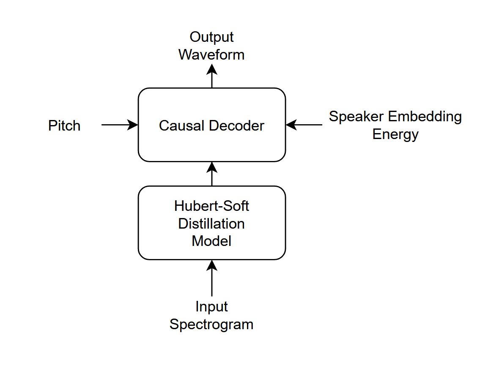

# FasterSVC : 軽量なAIボイスチェンジャー
(このリポジトリは実験段階のものです。内容は予告なく変更される場合があります。)

## モデル構造

デコーダーの構造はFastSVC, NeuCoSVC等を参考に設計。
未来の情報を参照しない"Causal"な畳み込み層を使用することで低遅延を実現。

## 特徴
- リアルタイム変換
- 低遅延 (約0.2秒程度、環境や最適化によって変化する可能性あり。)
- 位相とピッチが安定している (ソースフィルタモデルに基づく。)

## 必要なもの
- Python 3.10 以降
- PyTorch 2.0以降と GPU 環境
- フルスクラッチで訓練する場合は多数の人間の音声データを用意すること。(LJ SpeechやJVS コーパスなど。)

## インストール
1. このリポジトリをクローン
```sh
git clone https://github.com/uthree/fastersvc.git
```
2. 依存関係をインストール
```sh
pip3 install -r requirements.txt
```
## 事前学習モデルをダウンロードする
JVSコーパスで事前学習したモデルを[こちら](https://huggingface.co/uthree/fastersvc-jvs-corpus-pretrained)にて公開しています。

## 事前学習
基礎的な音声変換を行うモデルを学習する。この段階では特定の話者に特化したモデルになるわけではないが、基本的な音声合成ができるモデルをあらかじめ用意しておくことで、少しの調整だけで特定の話者に特化したモデルを学習することができる。

### 学習データの配置
以下のような配置にする必要がある。
```
dataset
├───speaker0
│   ├───xxx1-xxx1.wav
│   ├───...
│   └───Lxx-0xx8.wav
└───speaker1
    ├───xx2-0xxx2.wav
    ├───...
    └───xxx7-xxx007.wav
```
同じ話者の音声を同じディレクトリ内に配置する。

1. 前処理
データセットの前処理を行う。
```sh
python3 preprocess.py <dataset path>
```

2. ピッチ推定器を学習  
WORLDのharvestアルゴリズムによるピッチ推定を高速かつ並列に処理可能な1次元CNNで蒸留する。
```sh
python3 train_pe.py
```

3. コンテンツエンコーダーを学習。  
HuBERT-softを蒸留する。
```sh
python3 train_ce.py
```

4. デコーダーを学習  
デコーダーは、ピッチとコンテンツから元の波形を再構築することを目標とする。

```sh
python3 train_dec.py
```

### 学習オプション
- `-fp16 True` をつけると16ビット浮動小数点数による学習が可能。RTXシリーズのGPUの場合のみ可能。ただし安定性が低下する場合がある。
- `-b <number>` でバッチサイズを変更。デフォルトは `16`。
- `-e <number>` でエポック数を変更。 デフォルトは `60`。
- `-d <device name>` で演算デバイスを変更。 デフォルトは`cuda`。

## 推論
1. `inputs` フォルダを作成する。
2. `inputs` フォルダに変換したい音声ファイルを入れる
3. 推論スクリプトを実行する
```sh
python3 infer.py -t <ターゲットの音声ファイル>
```

### 追加のオプション
- `-a <0.0から1.0の数値>`で元音声情報の透過率を設定できます。
- `--normalize True` で、音量を正規化できます。
- `-d <デバイス名>` で演算デバイスを変更できます。もともと高速なのであまり意味がないかもしれませんが。
- `-p <音階>` でピッチシフトを行うことができます。男女間の音声変換に有用です。

## pyaudioによるリアルタイム推論 (テスト段階の機能です)
1. オーディオデバイスのIDを確認
```sh
python3 audio_device_list.py
```

2. 実行
```sh
python3 infer_streaming.py -i <入力デバイスID> -o <出力デバイスID> -l <ループバックデバイスID> -t <ターゲットの音声ファイル>
```
(ループバックのオプションはつけなくても動作します。)

## 参考文献
- [FastSVC](https://arxiv.org/abs/2011.05731)
- [NeuCoSVC](https://arxiv.org/abs/2312.04919)